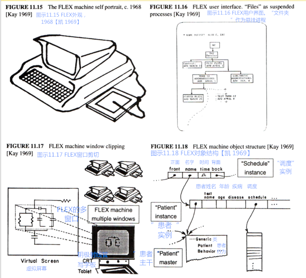

作为B5000一般化的描述符（descriptors），对象引用（object reference）被用于FLEX。
与一些提供参考号（referencing number）、阵列（array）和程序（procedure）的版式不同，FLEX的描述符包含两个指示器（pointer）：
第一个指向目标的“主干（master）”，第二个则指向对象实例（object instance）（后来我们意识到，为了节省空间，我们应当把主干指示器放置在实例中）。
为了完成一般任务，我们需要采用不同的方法。
B5000使用的是[左值（l-values）与右值（r-values）](http://baike.baidu.com/view/9489098.htm)，它们可以在一些情况下使用，但无法胜任更复杂的对象。
**例如，'a[55]:=0'，如果'a'是[稀疏数组（sparse array）](http://www.tuicool.com/articles/AfYnEf)，它的元素默认值为0，它也将在这个数组中产生一个值，因为':='是一个[算子（operator）](http://baike.baidu.com/view/53313.htm)，并且在任何人意识到右值是默认值前，'a[55]'会进入左值，不管'a'到底是一个数组还是数组中的前置程序。**（ For example: a[55] := 0, if a was a sparse array whose default element was 0 would still generate an element in the array because := is an "operator" and a[55] is dereferenced into an l-value before anyone gets to see that the r-value is the default element, regardless of whether a is an array or a procedure fronting for an array）
这时我们需要像'a(55, ':=', 0)'这样的命令，在进行任何储存之前，它可以先总览一遍所有的操作。
换句话说就是，这里':='不是算子，而是一种指数，它可以从复杂的对象中选取一个行为（behavior）。
为了见证这一过程，我着实花了不少时间。
我认为，其中一部分要归因于：为了使对象主宰它们自己的行为，人们不得不扭转传统的算子和功能等的概念：这些对象是[映射（mapping）](http://baike.baidu.com/view/21249.htm)的一种，它们的价值就在于这些行为。
[卡尔纳普（Carnap）](http://baike.baidu.com/view/111023.htm)有本关于逻辑的书，它通过解释：**同范围内的“内涵（intensional）”定义可被看成更传统的外延（extensional）技术，并且更直观也更方便**（ "intensional" definitions covered the same territory as the more traditional extensional technique and were often more intuitive and convenient），来辅助阐释这一概念。

