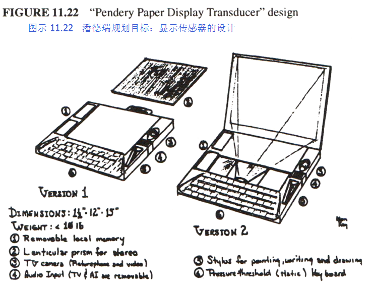

这时，在对Xerox的管理方面，我们又产生了冲突，跟规划主管唐·潘德瑞（Don Pendery）的冲突尤甚。
他其实完全不明白我们在说些什么，并且他感兴趣的是“发展趋势（trend）”、“未来会是什么样”以及Xerox如何继续“屹立不倒”。
我对此很反感，因此我对他说：“听着，对未来最好的预测就是我们创造它。不要太担心别人会做什么，在这个时代，只要我们对未来的展望足够清晰，我们就很可能实现它！”
他仍旧未被我说服，但这使得我们写出了著名的“潘德瑞的PARC规划目标（Pendery Papers for PARC Planning Purposes）”，这是一本文集，收录的文章涉及未来的放放面面。
其中，我建议我们未来的笔记本应当是“显示传感器（display transducer）”那样，而吉姆·米契尔（Jim Mitchell）的题目则是“在迷你计算机上运行NLS（NLS on a Minicomputer）。”

