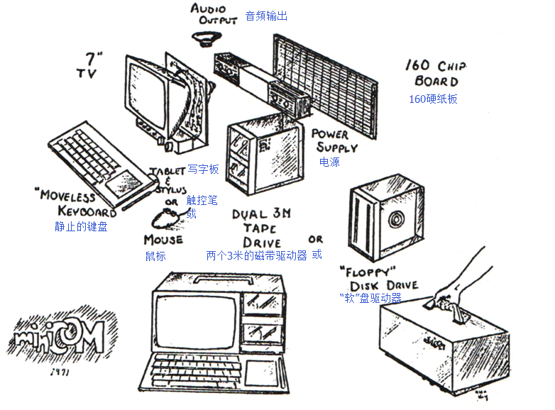

同年夏天，我提炼了KiddiKomp的想法，于是设计出了miniCOM。
它所使用的是像NOVA 1200那样的位片处理方法（bit-slice approach），它还有位图显示器（bit-map display）、[定点设备（pointing device）](http://baike.baidu.com/view/3645603.htm)、二级存储（实际上是三级），当然还有它的语言，我现在把这个语言叫做“Smalltalk”——因为“编程语言应当具备类似Smalltalk的性质”、“孩子们应当用Smalltalk编程”。
这样命名也是为了和“印欧神论（IndoEuropean god theory）”的命名方式相抗衡，在那种方法下，系统都被叫做[宙斯（Zeus）](http://baike.baidu.com/subview/15931/11100791.htm)、[奥丁（Odin）](http://baike.baidu.com/item/%E5%A5%A5%E4%B8%81/32493)、[托尔（Thor）](http://baike.baidu.com/subview/1897765/5135462.htm#viewPageContent)等等，尽管高大上，却并没什么用。
我发现“Smalltalk”这个名字给人的感觉是无关痛痒的，因此，如果它运行良好，人们反倒会感到惊讶（这种惊讶是讨人喜欢的）。

