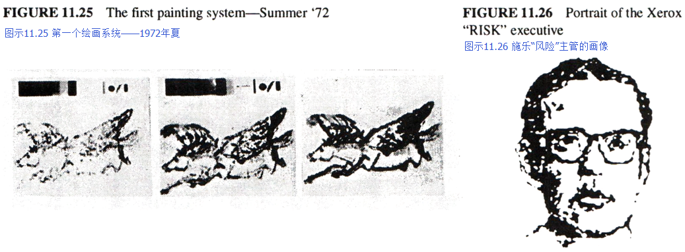

那时我找到了史蒂夫·博塞尔（Steve Purcell），彼时他是斯坦福的暑期生，负责把我的点阵画设想变为现实，这样孩子们就能在电脑上画画了。
约翰·肖奇（John Shoch）则负责线图（基于莱丁的设想【纽曼和斯普劳尔 72】）。
POLOS的比尔·杜瓦尔（Bill Duvall）设计了miniNLS，它的速度和功能令人印象深刻。
我们还制作出了第一个重叠窗口。
鲍勃·舒尔（Bob Shur）（在史蒂夫·博塞尔的帮助下）建立了2½D 动画系统。
而有了本·劳斯（Ben Laws）的字符编辑器，我们制作出了极为形象的demo，里面展示了往后几年我们所努力的方向。
我还记得我们递了一份demo给一位主管，甚至用我们的绘画系统为他画了自画像，然后嚣张地对他说：“它的绝妙之处在于，成功的可能性只有20%。我们正听你的话冒险！”
他直勾勾地看着我说：“孩子，这很不错，但务必取得成功。”
这是一名主管对风险的典型解读。
他要我们做那20%。

