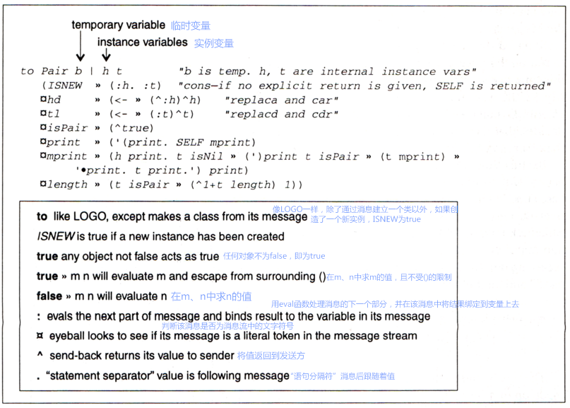

1. 一切皆对象
2. 对象间通过发送和接收（与对象相关的）消息交流
3. 对象有自己的内存（与对象相关）
4. 每个对象都是一个[类（class）](http://baike.baidu.com/subview/2390/8109879.htm#viewPageContent)（这个类也必须是一个对象）中的[实例（instance）](http://baike.baidu.com/item/Instance/5156585)
5. 类中包含着各个实例共有的性态（behavior）（在程序列表中以对象的形态呈现）
6. 为了用[eval函数](http://baike.baidu.com/item/eval%28%29)处理某个程序列表，电脑会控制第一个对象，余下的则被当做消息进行处理

目前为止，我们已经按照设计解释器的初衷，对大部分Smalltalk计划进行了划分，于是他们被分为六个主要想法。
前三个原理围绕着Smalltalk的功能——“外部对象”如何看待与使用它们。
数年来我们不需要对它们进行任何修改。
而后三个——来自内部的对象——则需要根据不同版本的Smalltalk（和之后面向对象的设计）进行微调。
计划（1）和（4）中暗示类就是对象，并且它们是自身的实例。
（6）则暗含一个像LISP那样通用的句法，但接收对象需放在首位，随后是消息。
因此c<sub>i</sub> <- de（用“&deg;”预先渲染，并用“*”进行乘法运算）表示：
```
receiver | message
c        | ° i <- d*e
```
`c`与接收对象相关联，而`° i <- d*e`则是消息。
这则消息由文字标记“°”、i（在发送方的语境下需要被评估的表达）、另一个文字标记“<-”和之后的d*e（在发送方的语境下需要被评估的表达）组成。
由于“LISP”的搭配由两个元素对象构成，它们可以以更简洁的方式呈现：`c hd`、`c tl`和`c hd <- foo`等。

一开始，要表达像a+b和3+4这样“简单”的概念似乎更加麻烦。用下面的形式来思考它们真的合理吗：
```
receiver | message
a        | + b
3        | + 4
```
只考虑到整数的话它看上去挺蠢的，但“+”还有着其它隐喻，例如：


这就生成了一种为信息符号（message symbol）寻找通用行为（generic behaviors）风格。
[“多态性（polymorphism）”](http://baike.baidu.com/item/%E5%A4%9A%E6%80%81%E6%80%A7)是其官方表达（我认为这个词源自克里斯托弗・斯特雷奇（Strachey）），但它与最初的意义有所偏差。
最初它只应用在功能上，而这个功能可以携带不止一种类型的参数（argument）（译者注：parameter和argumentd的区别在于，前者指函数定义中的参数，后者指函数调用时的实际参数）。
在Smalltalk-72中，诸如cons对象（原文中为cons pairs，是LISP中constructs memory objects的别称，故此翻译）模型这样的object类可以是如下这样：



由于在考虑处理剩下来的信息之前，已经对类进行了控制——类也可以自行决定不接受控制——整个程序完全受保护的。
Smalltalk-72的对象是“耀眼的”，但不会受攻击的影响。
环境中有一部分是将“messenger对象”（一个广义上的活动记录）与发送方相关联，这样接收方就能赋予其不同的权利（更多细节见附录II）。
这一想法可以联系到未来Smalltalk作为网络操作系统的最终用途上（见【Goldstein & Bobrow 1980】），在我印象中，它并没怎么应用在Smalltalk-72上。

Smalltalk-71保留的形式之一就是混合功能与类的概念。在其他操作中，Smalltalk-72的类看上去像功能，并且可以作为功能而使用，但使用了ISNEW对象，它可以轻易地创造出实例（程序停止运行的一种情况）。
因此阶乘（factional）可以延伸为如下形式：
```
to fact n (^if :n=0 then 1 else n*fact n-1)
```
或者作为整数类的一种内化成以下形式：
```
(... ¤! » (^:n=1) » (1) (n-1)!)
```

当然，整个Smalltalk（一般来说是面向对象）的想法是将一切事物向内延伸。
它过去是我们学习如何用新的形式来编程的方向。
我一点都不喜欢这种句法（括号和嵌套结构太多），因此我希望在Smalltalk-71中使用更优美更注重语法的语言。
下面是句法的示例，摘取自之后的笔记。
几年后，我们会在丹为Smalltalk-76设计的程序中看见更多这样的例子。
我认为LISP身上也出现了相似的情况——我们从未设计出过真正简单又实用的句法。
```
建议采用的Smalltalk-72句法

Pair :h :t
    hd <- :h
    hd              » h
    tl <- :t
    tl              » t
    isPair          » true
    print           » '( print. SELF mprint.
    mprint          » h print. if t isNil then ') print
                               else if t isPair then t mprint
                               else '* print. t print. ') print
    length          » 1 + if t isList then t length else 0
    ```
    
